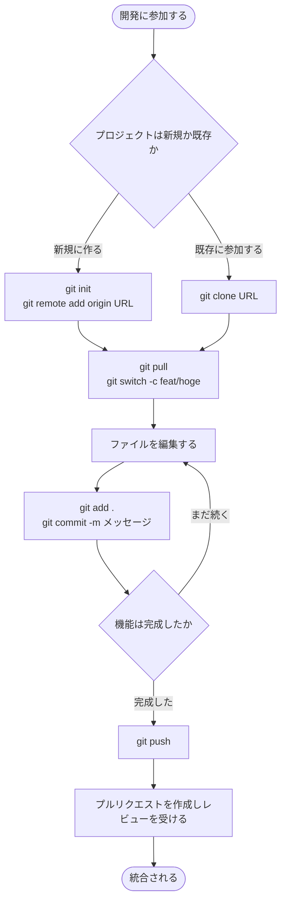

## Gitを使おう

### なぜGitを用いるか

Gitは，ファイルの変更履歴を記録し，管理するためのツールである．このような仕組みを一般にバージョン管理システムと呼ぶ．

バージョン管理を適切に行うことで，次のような利点が得られる．

- いつ，誰が，どこを変更したのかわかる
- 過去の状態に戻せる

適切なバージョン管理システムを用いることで，次のような事態が避けられる．

「レポートやプログラムを書く際に，`report_final.docx`，`report_final2.docx`，`report_提出版.docx`，`report_提出版_修正.docx`のように収拾がつかなくなる．」

Gitを使うと，次のことができるようになる．

- 変更の履歴を意味のある単位(コミット)で保存し，いつでも復元できる
- 複数人がそれぞれ作業した変更を，安全に統合できる

特に近年のバージョン管理システムでは，Gitは事実上の標準であり，使えることが前提である．

### 到達目標

この講座での目標を三段階で示す．

#### 最低限到達してほしい目標

すべてのチーム開発の作業者が理解しておいてほしい内容である．

- Gitの基本概念と操作
  - Gitとホスティングサービスの違い
- Gitコマンド
  - `git add .`
  - `git commit -m "メッセージ"`
  - `git push`
  - `git pull`
  - `git clone`
  - `git switch ブランチ名`
  - `git switch -c ブランチ名`
- VSCodeのGUIでの操作
  - ファイルの変更状況の確認
  - ステージング状況の確認
  - コミット前の変更の破棄
  - ブランチの一覧の確認
- ホスティングサービスでの操作
  - Issueの作成
  - プルリクエスト(マージリクエスト)の作成

#### 到達してほしい目標

ここまでできれば一般的にもGitの基本操作ができるといってもいいと思われる．

- 最低限のすべての内容
- Gitの基本概念と操作
  - `.gitignore`ファイルによるGit管理ファイルの設定
  - リポジトリとワーキングツリー
  - ステージングとコミット
  - ブランチ
  - コンフリクトの解消
- Gitコマンド
  - `git init`
  - `git remote`
  - `git branch`
  - `git stash`
- ホスティングサービスでの操作
  - Issueの管理
  - レビュー
- より良い開発慣行
  - ルールセットによるデフォルトブランチの保護
  - コミットメッセージの良し悪し
  - ブランチの分離と多人数での作業
  - プルリクエストとレビューの意義
  - ドキュメンテーション

#### 発展目標

あまり本講座では説明しないかもしれないが，おいおい理解してほしい内容である．

- 到達してほしい目標のすべての内容
- Gitの概念
  - グラフ構造
  - HEAD
  - fast-forward
  - リモート追跡ブランチ
  - `git pull`と`git fetch`, `git merge`の関係
- Gitコマンド
  - `git status`
  - `git log`
  - `git reflog`
  - `git fetch`
  - `git merge`
  - `git restore`
  - `git commit --amend`
  - `git rebase`
- より良い開発慣行
  - CI/CD

### gitの設定

Gitを使い始める前に，最低限の設定を済ませておく．
設定を整えておくことで，環境による予期しない挙動や，毎回の余計な操作を避けられる．

まず，コミットに記録される名前とメールアドレスを設定する．

```bash
git config --global user.name "github等に登録したユーザー名"
git config --global user.email "github等に登録したメールアドレス"
```

次に，以下を設定ファイル（`~/.gitconfig`）に追記しておくとよい．

> チルダ`~`はホームディレクトリ(Winでは`C:\Users\あなたのユーザー名`)を示す

```conf
[init]
	defaultBranch = main

[push]
	autoSetupRemote = true

[fetch]
	prune = true
```

それぞれの意味は次のとおりである．

- `init.defaultBranch = main`
  `git init`で作られる最初のブランチ名を`main`にする．多くのホスティングサービスが`main`を既定としているため，これに合わせる．
- `push.autoSetupRemote = true`
  新しいブランチを初めてpushするとき，対応するリモートブランチを自動的に設定する．これにより，毎回`git push -u origin ブランチ名`と指定せず，`git push`だけで済むようになる．
- `fetch.prune = true`
  リモートで削除されたブランチに対応する追跡ブランチを，`fetch`時に自動で整理する．手元に不要な参照が残るのを防げる．


### 大まかな全体の流れ

個々のコマンドの詳細は後の章で扱う．ここでは，開発の中でGitをどのような順序で使うのかを概説する．



新規に作る人は最初の一度だけリポジトリを作成し，既存に参加する人は複製するだけでリモートが自動的に設定される．以降の作業ごとのサイクルは両者で共通である．

個人開発では，プルリクエストでAIによるレビューを受けたり，mainへ直接プッシュしたりすることもある．

