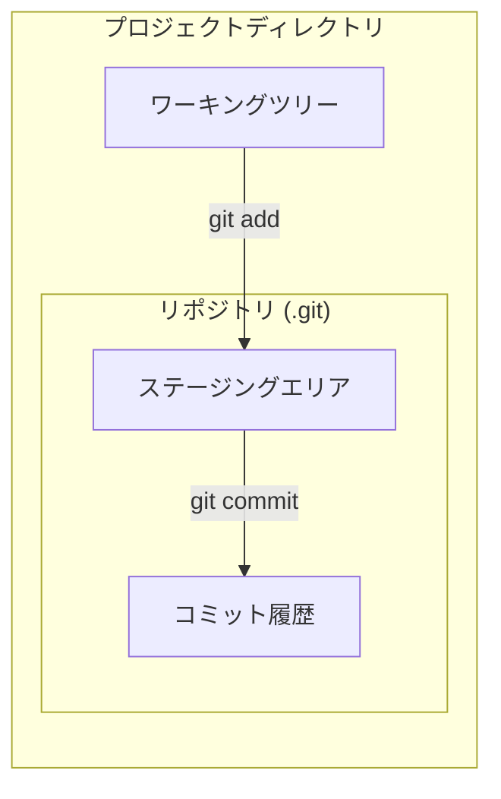

## ローカルでの変更の保存

### Gitでの管理を始める

あるディレクトリ配下をGitで管理するには，そのディレクトリで`git init`を用いる．

```bash
git init
```

これにより空のGitリポジトリとして`.git`ディレクトリが作成される．
以降で登場するステージングエリアやブランチの実体はここに配置されることとなる．

### ステージングとコミット

Gitでは作業を保存する単位をコミットという．
コミットを作成できるようになれば，ローカルで変更を保存する操作はokである．

Gitはファイルを次の三つの領域に分けて扱う．

- ワーキングツリー: 実際にファイルを編集する作業場所
- ステージングエリア: 次のコミットに含める変更を準備しておく場所
- コミット履歴: 確定した変更がコミットとして積み重なって記録される場所

ファイルを編集しただけでは，その変更はワーキングツリーにあるだけで，コミットには含まれない．
まず`git add`で変更をステージングエリアに登録し(ステージング)，次に`git commit`でステージングエリアの内容を一つのコミットとして履歴に記録する．

ステージングエリアはワーキングツリーとは独立しており，`git add`によってワーキングツリーから変更がコピーされる．
そのため，編集した変更のうち一部だけをステージングして，意味のある単位でコミットを分けることもできる．

これらの領域の関係を図に示す．ステージングエリアとコミット履歴の実体は，先に作成した`.git`ディレクトリ(リポジトリ)の中にある．



### ステージング

ステージングを行うには`git add`を用いる．引数には，ステージングしたいファイルやディレクトリを指定する．

```bash
git add <ファイル名>
```

特定のファイルだけでなく，変更したファイルをまとめて登録することも多い．
カレントディレクトリ以下のすべての変更をステージングするには`.`を指定する．

```bash
git add .
```

後述の`.gitignore`で無視するよう設定したファイルは，`git add .`の対象から外れる．

またはVSCodeの画面左にある，○が3つくっついているアイコンのタブ(ソース管理ビュー)から，どのファイルをステージングするか選択できる．
このビューには変更されたファイルの一覧が表示され，各ファイルにカーソルを合わせると現れるプラスアイコン`+`(変更をステージ)を押すとステージできる．
また，ファイル名をクリックすれば変更前後の差分が表示され，何をステージングしようとしているかを確認できる．

### `.gitignore`

ステージングをしたくないファイルがワーキングツリー内にあることがある．
例えば，ビルド時の一時ファイルや成果物，外部から取得できる依存ライブラリ，パスワードを含む設定ファイルなどである．
これらをGitの管理対象から外すための設定ファイルが`.gitignore`である．

リポジトリのルートに`.gitignore`という名前のファイルを作成し，無視したいファイルのパターンを1行ずつ記述する．

```gitignore
# 行頭が # の行はコメントになる

# 特定の拡張子をすべて無視する
*.exe

# 特定のファイルを無視する
secret.env

# ディレクトリ以下をまとめて無視する
build/
```

`.gitignore`のパターンに一致するファイルは，`git add .`を実行してもステージングされなくなる．
ただし，すでにGitの管理下に入っている(追跡済みの)ファイルには効果がない点に注意する．
その場合は，別途追跡を解除する操作が必要になる．

### コミットの作成とメッセージ

新しいコミットを作成するには`git commit`を用いる．

コミットにはそのコミットで何を行ったかを記載するコミットメッセージを付与することはほぼ必須である．
これにはオプションとその引数として`-m <msg>`または，`--message=<msg>`を用いる．

```bash
git commit -m "feat: hoge機能追加"
```


コミットメッセージにはいろいろな流儀があるが，ここではどのような変更かを表すprefixと，具体的な説明をコロンで区切った形式を用いる．

良い例

```bash
git commit -m "fix: プレイヤーの顔が180度回転するバグを修正"
git commit -m "add: 依存関係を追加"
git commit -m "chore: 画像ファイルを追跡しないように"
git commit -m "feat: プレイヤーの体力を半分にするモードの追加"
git commit -m "clean: ExContext.csの設計の改善"
```

悪い例

```bash
git commit -m "頑張った"
git commit -m "modify"
git commit -m "modify: main.c"
git commit -m "2026-06-12"
```

### コミットの指定

今後登場するいくつかのコマンドにおいては，特定のコミットを指定しする必要がある．
ここではその手法を示す．

### ここまでの図示


