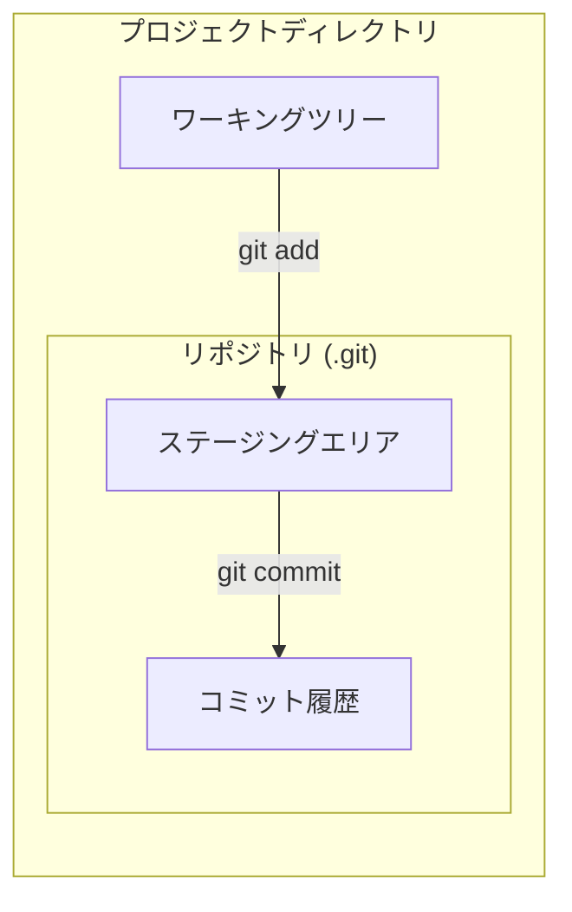
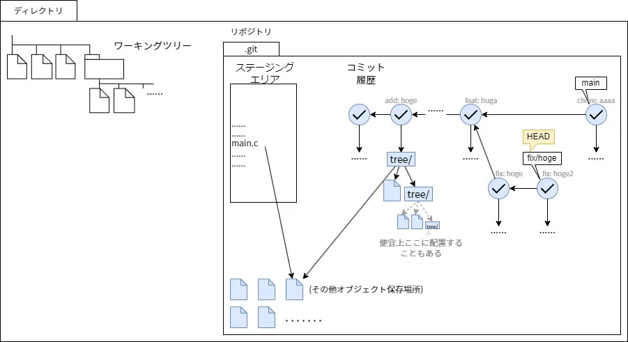
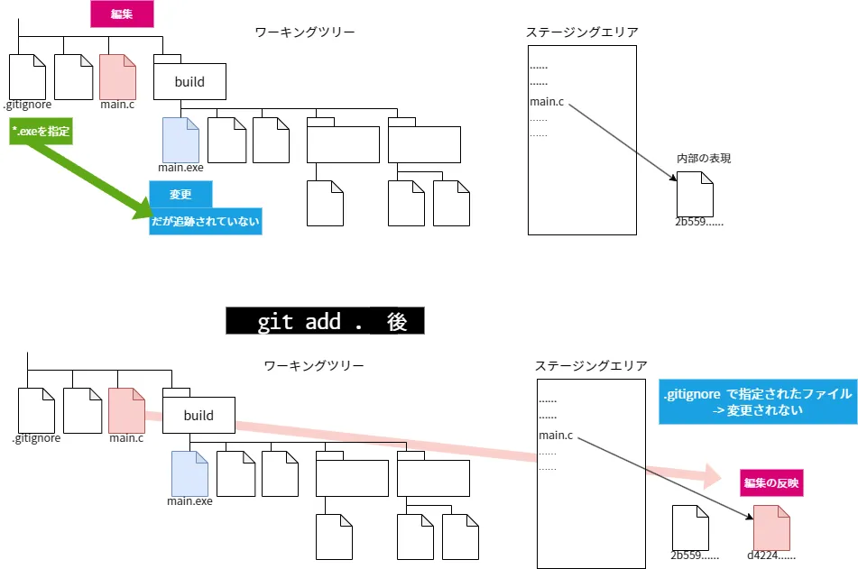
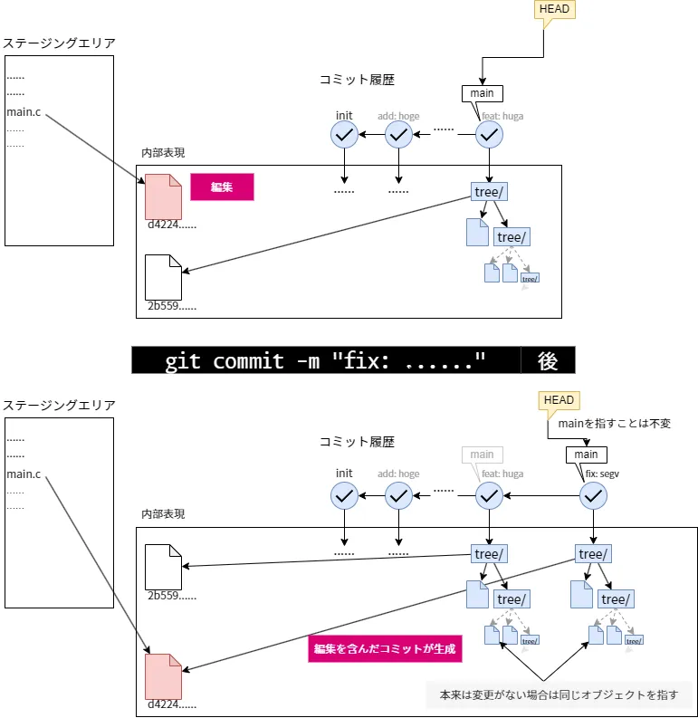
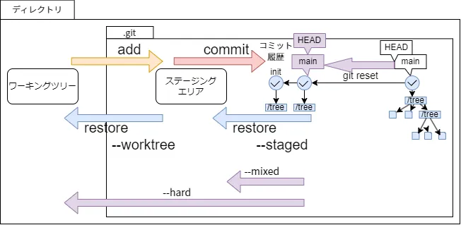

## ローカルでの変更の保存

### Gitでの管理を始める

あるディレクトリ配下をGitで管理するには，そのディレクトリで`git init`を用いる．

```bash
git init
```

これにより空のGitリポジトリとして`.git`ディレクトリが作成される．
以降で登場するステージングエリアやブランチの実体はここに配置されることとなる．
これをリポジトリという．

> ワーキングツリーもリポジトリの一部であると考えることが自然なこともあるが，便宜上そうする

### ステージングとコミット

Gitでは作業を保存する単位をコミットという．
コミットを作成できるようになれば，ローカルで変更を保存する操作はokである．

Gitはファイルを次の三つの領域に分けて扱う．

- ワーキングツリー: 編集しているディレクトリやファイル
- ステージングエリア: 次のコミットに含める変更を準備しておく場所
- コミット履歴: 確定した変更であるコミットのつながり

ファイルを編集しただけでは，その変更はワーキングツリーにあるだけで，コミットには含まれない．
まず`git add`で変更をステージングエリアに登録し，次に`git commit`でステージングエリアの内容を一つのコミットとして履歴に追加する．

これらの領域の関係を図に示す．ステージングエリアとコミット履歴の実体は，先に作成した`.git`ディレクトリ(リポジトリ)の中にある．





より後の章に説明する概念として，mainやHEADがあるが，これらは現時点では最新のコミットを指すとしてよい．

### ステージング

ステージングを行うには`git add`を用いる．引数には，ステージングしたいファイルやディレクトリを指定する．

```bash
git add <ファイル名>
```

特定のファイルだけでなく，変更したファイルをまとめて登録することも多い．
カレントディレクトリ以下のすべての変更をステージングするには`.`を指定する．

```bash
git add .
```

後述の`.gitignore`で無視するよう設定したファイルは，`git add .`の対象から外れる．

またはVSCodeの画面左にある，○が3つくっついているアイコンのタブ(ソース管理ビュー)から，どのファイルをステージングするか選択できる．
このビューには変更されたファイルの一覧が表示され，各ファイルにカーソルを合わせると現れるプラスアイコン`+`(変更をステージ)を押すとステージできる．
また，ファイル名をクリックすれば変更前後の差分が表示され，何をステージングしようとしているかを確認できる．

### ステージングしないファイルの設定

ステージングをしたくないファイルがワーキングツリー内にあることがある．
例えば，ビルド時の一時ファイルや成果物，外部から取得できる依存ライブラリ，パスワードを含む設定ファイルなどである．
これらをGitの管理対象から外すための設定ファイルが`.gitignore`である．

リポジトリのルートに`.gitignore`という名前のファイルを作成し，無視したいファイルのパターンを1行ずつ記述する．

```gitignore
# 行頭が # の行はコメントになる

# secret.envを指定する
secret.env

# *はスラッシュ以外のすべての"文字列"を表す
# *temp*
# tempが含まれるすべてのファイル等を指定したことになる

# .exeで終わるすべてのファイル等を指定する
*.exe

# ディレクトリ配下のファイル等をすべて指定する
build/
```

`.gitignore`のパターンに一致するファイルは，`git add .`を実行してもステージングされなくなる．
ただし，すでにGitの管理下に入っているファイルには効果がない点に注意せよ．
その場合は`git rm --cached`を用いる必要がある．




### ワーキングツリーの状態を表示する

<!-- git status -->

### コミットの作成とメッセージ

新しいコミットを作成するには`git commit`を用いる．
この操作によって，ステージングエリアの状況がすべて記録され，任意のコミットの状態に巻き戻すことが可能となる．

最初のコミットは独立して生成されるが，それ以降のコミットは現在のHEADが指すコミットを親として持つコミットとなる．
またこの操作によって，HEADは新しく作成したコミットを指すことになる．

コミットにはそのコミットで何を行ったかを記載するコミットメッセージを付与することはほぼ必須である．
これにはオプションとその引数として`-m <msg>`または，`--message=<msg>`を用いる．

```bash
git commit -m "feat: hoge機能追加"
```

コミットメッセージにはいろいろな流儀があるが，ここではどのような変更かを表すprefixと，具体的な説明をコロンで区切った形式を用いる．

良い例

```bash
git commit -m "init"
git commit -m "fix: プレイヤーの顔が180度回転するバグを修正"
git commit -m "add: 依存関係を追加"
git commit -m "chore: 画像ファイルを追跡しないように"
git commit -m "feat: プレイヤーの体力を半分にするモードの追加"
git commit -m "clean: ExContext.csの設計の改善"
```

次のような後からどのような変更をしたかわからないコミットメッセージは良くない．

```bash
git commit -m "頑張った"
git commit -m "modify"
git commit -m "modify: main.c"
git commit -m "2026-06-12"
```



### コミット履歴の表示

<!-- git log -->

### コミットの指定

今後登場するいくつかのコマンドにおいては，特定のコミットを指定する必要がある．
ここではその手法をいくつか示す．

| 指定方法                    | 例                                         |
| --------------------------- | ------------------------------------------ |
| コミットのハッシュ値        | `b3c725038bc0e3a90b6ad1ee36fc0071545eb682` |
| 4桁以上で一意に定まる短縮形 | `b3c7250`                                  |
| 参照                        | HEAD, main                                 |
| コミットの演算              | \<commit\>に対して~, ~2, ^, ~2, ~^         |

まず，コミットオブジェクトは，そのオブジェクトのハッシュ値によって指定できる．

`git commit`したときの出力

```
> git commit -m "add: コミットの図を追加"
[main b3c7250] add: 図を追加
 6 files changed, 1179 insertions(+)
 create mode 100644 draw/add.drawio
 ...
```

における`b3c7250`がハッシュ値の短縮形である．
また，前述の`git log`を用いることで短縮でないハッシュ値を得ることができる．

```
> git log
......(略)
commit 56b598721e2aacf28cb4f6d87fe1d7cf8783d553
Author: hinshiba <105423175+hinshiba@users.noreply.github.com>
Date:   Tue Jun 16 22:39:09 2026 +0900
```

これまた後述するHEADやmainを用いることもできる．

さらに，コミットに関する演算を行うことができる．

| 演算子 | 意味                   | 例     |
| ------ | ---------------------- | ------ |
| `~{n}` | $n$世代前の親(の1番目) | HEAD~2 |
| `~`    | `~1`と同値             | HEAD~  |
| `^{n}` | (1世代前の)$n$番目の親 | HEAD^2 |
| `^`    | `^1`と同値             | HEAD^  |

`^`は複数の親を持つコミットにおいて，親を選択するために用いる．

また，これら自体もコミットを指すため，`HEAD^^2~3`のような記法も許可される．

### ここまでの図示

