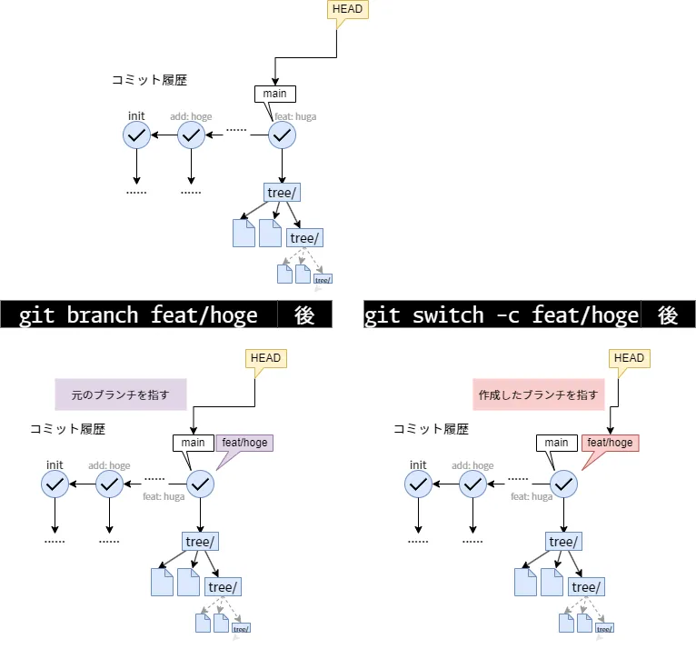
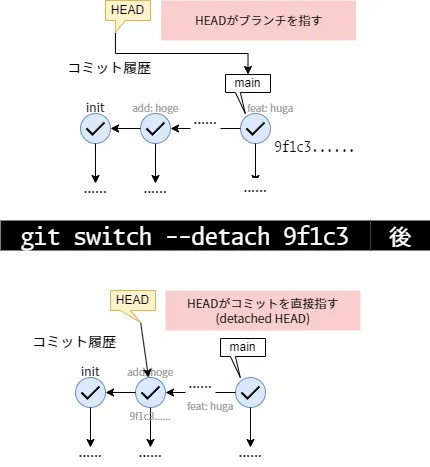
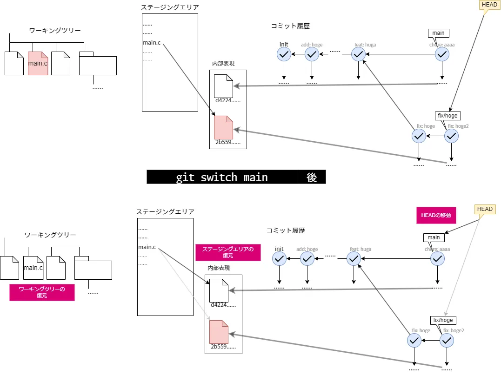
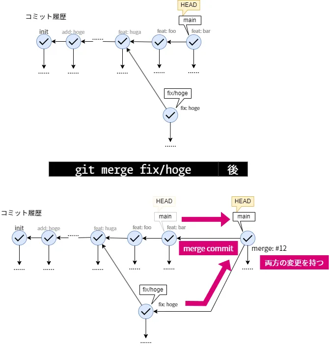

## ブランチの操作

ブランチは枝を意味し，1つの状態から複数の状態を作成できる．
ブランチによって，コミットをいくつかまとめた大きな作業の単位を適切に表現できる．
さらに，ブランチ同士は互いに影響しないため，状態を保全したりチームでの開発を進めたりできる．

ブランチの実体は，あるコミットを指す参照である．
新しいコミットを作成すると，前述のとおり現在のブランチがその新しいコミットを指すように進む．
この章では，ブランチを作成し，移動し，結合し，不要になったら削除するまでの操作を扱う．

### ブランチを作成する

ブランチを管理するコマンドが`git branch`である．
引数にブランチ名を与えると，**現在のコミットを指す**新しいブランチを作成する．

```bash
git branch <ブランチ名>
```

ただし`git branch`はブランチを作成するだけで，作成したブランチへ移動はしない．
実際には，作成と移動を同時に行う`git switch -c <ブランチ名>`のほうをよく使う．

```bash
git switch -c <ブランチ名>
```

`git switch`は次の節で述べる移動のコマンドであり，`-c`はブランチを作成してから移動するオプションである．
作成と移動が一つの操作にまとまっているため，手順を一つ減らせる．

引数を与えずに`git branch`を実行すると，ブランチの一覧が表示され，現在いるブランチに`*`が付く．

```bash
git branch
```

ブランチ名にはスラッシュを含められる．
`feat/login`や`fix/typo`のように，目的ごとに接頭辞を付ける書き方が広く使われている．
これは名前を整理するための慣習だが，参照は内部でこの名前のままファイルとして保存される．
そのため，`feat/login`があると，`feat`をディレクトリとして使うことになり，`feat`という名前のブランチは同時には作成できないことに注意せよ．

`git init`で最初に作られるブランチを**デフォルトブランチ**という．
その名前は設定で変更でき，本資料では00章で`init.defaultBranch`を`main`に設定している．
デフォルト設定は，Git 2.28以降では`main`，それ以前は`master`である．
多くのホスティングサービスも`main`を既定とするため，これまでの説明でも`main`ブランチにコミットを追加してきた．

> `git checkout`でも同様にブランチの作成や移動ができるが，これは移動と復元を兼ねた古いコマンドである．
> 新しいコマンドとして`git switch`と`git restore`へ分かれているため，本資料では`git switch`を用いる．



VSCodeでは，画面左下のステータスバーに現在のブランチ名が表示される．
これをクリックすると現れるメニューから，ブランチの新規作成や，既存ブランチからの作成ができる．

### ブランチへ移動する

別のブランチへ移動するには`git switch`を用いる．

```bash
git switch <ブランチ名>
```

このコマンドでは，**HEAD**が指す先が指定したブランチに変わり，ワーキングツリーの内容もそのブランチのコミットの状態へ更新される．
**HEAD**は現在どのコミットを見ているかを表す参照であり，基本的には現在のブランチを指している．
そしてそのブランチが指す最新のコミットを指している．

ブランチ名ではなく特定のコミットを直接指定して移動することもできる．

```bash
git switch --detach <コミット>
```

このときHEADはブランチを経由せず，そのコミットを直接指す状態になる．
これを**detached HEAD**という．

detached HEADの状態でコミットを作成しても，そのコミットはどのブランチからも参照されない．
別のブランチへ移動すると，参照を失ったコミットは見つけにくくなり，最終的には削除されることがある．
その状態のコミットを残したいときは，ブランチを作成して名前を与えればよい．

```bash
git switch -c <ブランチ名>
```

> `git switch -c <ブランチ名>`は現在のコミットを指す新しいブランチを作成することに注意せよ．



単にもとのブランチへ戻りたいだけなら，ブランチ名を指定して移動すればよい．
直前にいたブランチへは`-`で戻れる．

```bash
git switch main
```

や

```bash
git switch -
```

を実行するとよい．

VSCodeでは，ステータスバーのブランチ名をクリックすると，移動先のブランチを一覧から選んで切り替えられる．

<!-- どのようにこのようなコミット履歴ができるか説明 -->



### ブランチを結合する

分かれたブランチの変更を一つにまとめる操作がマージである．
`git merge`は，指定したブランチの変更を**現在のブランチへ**取り込む．

```bash
git merge <取り込むブランチ名>
```

分岐してから現在のブランチに新しいコミットが一つも増えていない場合，マージは**fast forward**となる．
このとき新しいコミットは作られず，現在のブランチの参照を相手のコミットまで進めるだけで済む．
分岐の履歴を残したいときは`--no-ff`を付けると，fast forwardできる場合でもマージコミットを作成する．

```bash
git merge --no-ff <取り込むブランチ名>
```



次の章で述べるが，多くの場合ローカルでマージするのではなく，
リモートリポジトリのホスティングサービス上でマージすることがほとんどである．

<!-- ff mergeについて図示 -->

### コンフリクトを解消する

両方のブランチが同じ箇所を別々に変更していると，Gitはどちらを採用すべきか判断できない．
この状態を**コンフリクト**(衝突)といい，マージは中断される．

コンフリクトが起きると，対象のファイルに次のような目印が書き込まれる．

```
<<<<<<< HEAD
現在のブランチ側の内容
=======
取り込むブランチ側の内容
>>>>>>> <取り込むブランチ名>
```

`=======`を境に，上が現在のブランチの内容，下が取り込む側の内容である．
解消するには，このファイルを編集して最終的に残したい内容に書き換え，目印の3行を消す．
内容を確定したら`git add`でステージングし，`git commit`でマージを完了する．

```bash
git add <ファイル名>
git commit
```

VSCodeでは，コンフリクトしたファイルがソース管理ビューの「マージの変更」に表示される．
そのファイルを開くと競合箇所の上に選択肢が現れ，「現在の変更を取り込む」「入力側の変更を取り込む」「両方の変更を取り込む」などを選んで解消できる．

### 作業を退避する

編集の途中で，コミットするほどではない変更を抱えたまま別のブランチへ移りたいことがある．
`git stash`は，コミットしていない変更を一時的に退避し，ワーキングツリーを直前のコミットの状態へ戻す．

```bash
git stash
```

退避した変更を戻すには`git stash pop`を用いる．
これは退避した内容をワーキングツリーへ復元し，退避の一覧からは取り除く．

```bash
git stash pop
```

`git stash`が退避するのは，追跡されているファイルの変更だけである．
まだ一度も追跡されていないファイルも退避するには`-u`を付ける．

```bash
git stash -u
```

退避は重ねて行えるため，何の作業を退避したのかを後から区別したいことがある．
`push -m`で退避にメッセージを付けられる．

```bash
git stash push -m "ログイン画面の作りかけ"
```

### ブランチを削除する

マージなどで役目を終えたブランチは削除できる．
`git branch -d`は，変更が他のブランチへ取り込まれ済みのブランチを削除する．

```bash
git branch -d <ブランチ名>
```

まだどこにも取り込まれていないブランチを`-d`で削除しようとすると，変更が失われるのを防ぐためGitは削除を拒む．
取り込まれていないと承知のうえで削除するには，`-D`を用いる．

```bash
git branch -D <ブランチ名>
```

VSCodeでは，コマンドパレットの「Git: ブランチの削除」からブランチを選んで削除できる．
