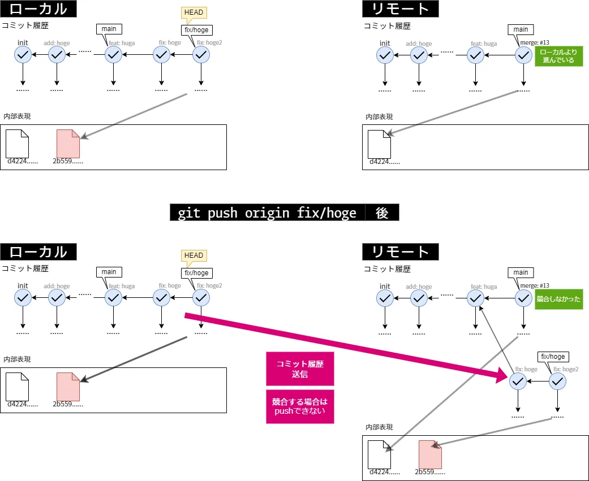
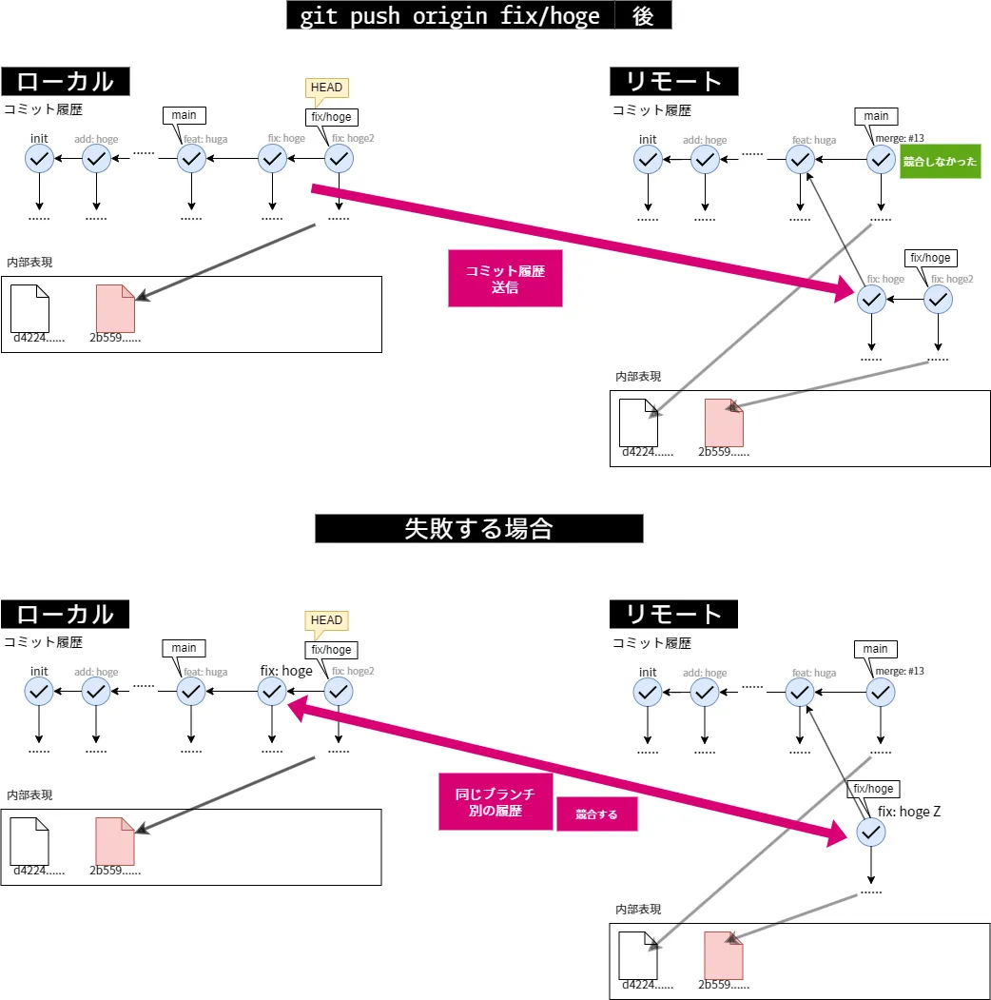
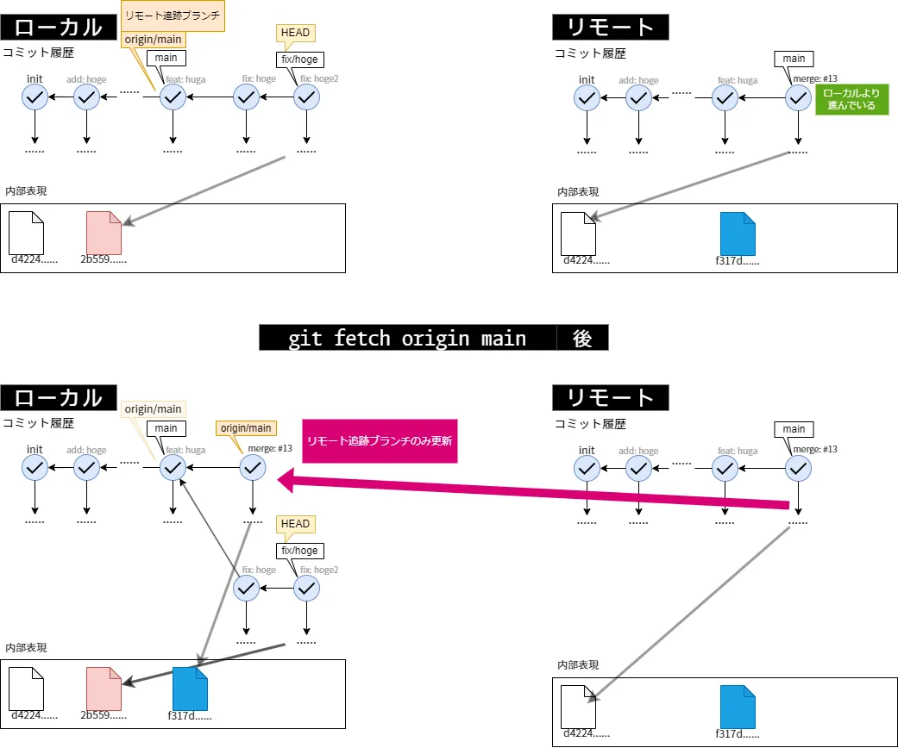
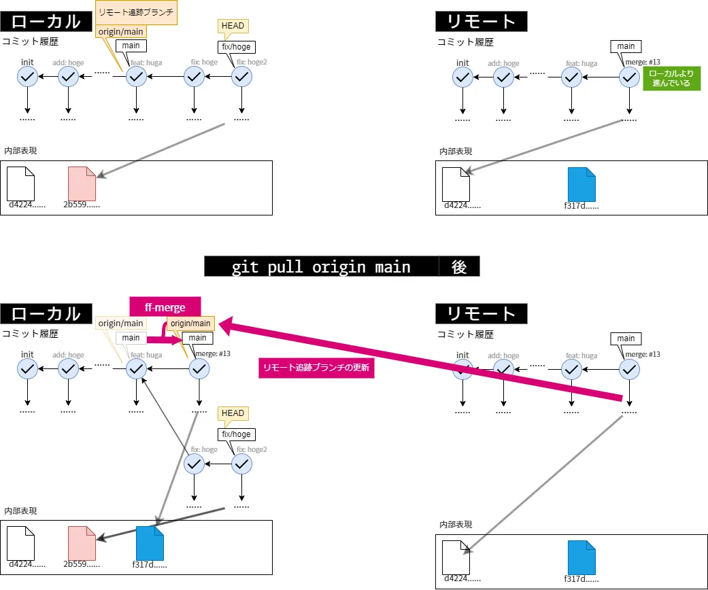
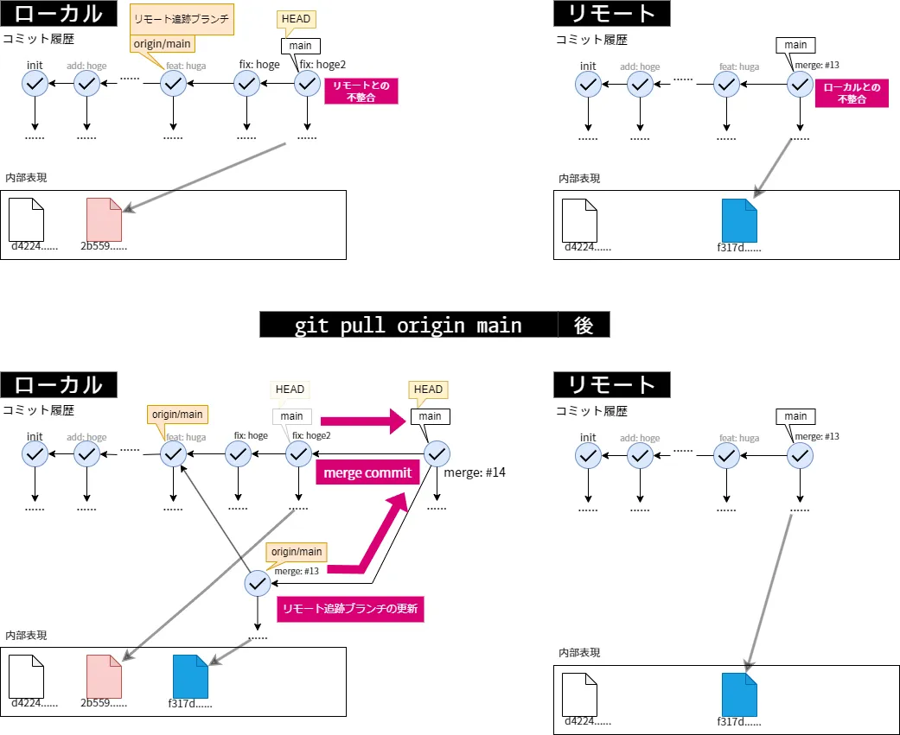

## リモートリポジトリとその操作

Gitは分散型バージョン管理システムであり，リポジトリを保存する中央のサーバーがなくても機能する．
しかし実際は，開発に参加する全員が合意したリポジトリの保存場所があると便利である．
最新のmainブランチを誰が持っているのかを他の開発者全員に聞く必要がなくなるからである．

この中央のサーバーに保存されているリポジトリを，いままでの個人の端末にあったリポジトリと区別してリモートリポジトリと呼ぶ．
また，今までの端末にあるリポジトリはローカルリポジトリである．

> リモートリポジトリは必ずしも中央のサーバーで保存されている必要なく，ローカルリポジトリと同じ端末上にあっても良い．
> 形式的にはリモートリポジトリとして登録されている別のリポジトリが，そのリポジトリからみてリモートリポジトリというだけである．

リモートリポジトリは開発者の共同で使えるサーバーでよいが，
多くの場合GitHub, Inc.が運営するGitHubというホスティングサービスを用いることとなる．
他にもGitLabやCodebergというサービスや，簡単に個人のサーバーでリモートリポジトリを管理できるGitea等がある．
多くのホスティングサービスでは，WebUI上でブランチのマージやレビュー，バグ追跡，CI/CDを行う開発に便利なサービスを提供しており，
これらをある程度使えることも開発には要求される．

本章では，リモートリポジトリを用いて開発を共有しながら管理する手法について説明する．
以降はリモートリポジトリをリモートと略する．

### SSH鍵を用いた認証

一般的なGitHub等のリモートには，許可されていないユーザーからの変更を防ぐために認証が必要である．
リモートの変更のたびに，そのサービスのユーザー名とパスワードを入力するのは非効率的であるため，
自動で認証を行う手法を説明する．

SSHはSecure Shellの略で，公開暗号方式/認証を用いてネットワーク上の他の端末との通信を行うプロトコルである．
一般的なホスティングサービスはSSH鍵によって認証を行うことができる．

SSH鍵を作成する場合は次のコマンドを実行する．

```bash
ssh-keygen -t ed25519 -C "github@notebook1"
```

コメント部分には，ユーザー名やデバイス名，用途等を記入しておくとよい．

ファイル名，パスフレーズ，パスフレーズの再入力を順に聞かれるため適切に回答する．
他の用途に複数のSSH鍵を作成している場合は，ファイル名をデフォルトから変更し，SSH鍵をホストごとに設定するとよい．

すべてデフォルトで設定すると`~/.ssh`(チルダ`~`はホームディレクトリ(Winでは`C:\Users\あなたのユーザー名`)を示す)に`ed25519`と`ed25519.pub`が生成されるはずである．

**拡張子のついていない`ed25519`は秘密鍵であり，決して他人に知られてはいけない．**
もし知られた恐れのある場合は，すべてのサービスで対応するすべての公開鍵を削除する必要がある．

`.pub`のついている`ed25519.pub`は公開鍵であり，公開しても問題がない．
**こちらをGitHubといったサービスで登録する**ことで，対応する秘密鍵を持っているかが自動的に検証され，自動的にログインが行われる．


複数の鍵を持っており，設定する場合の例を以下に示す．

```conf
# ~/.ssh/config
Host github.com                         # 接続先のエイリアス
    HostName github.com                 # 接続先
    User git                            # ログインするユーザー名
    Port 22                             # ポート番号
    IdentityFile ~/.ssh/github_secret   # 秘密鍵の場所
    TCPKeepAlive yes
    IdentitiesOnly yes
```

また，`.gitconfig`で設定する手法もある．

### リモートを設定する

リポジトリにリモートを設定し管理するコマンドとして`git remote`がある．

サブコマンドを付与せず実行することで，登録されているリモートの一覧を表示できる．
また，`-v`オプションを付与することでより詳細な情報が得られる．

> `-v`は`--verbose`の短縮であり，今まで登場したコマンドのすべてや，Git以外のコマンドの多くで利用可能である．
> このオプションが付与されている場合，通常は出力しないより詳細な情報を出力する．

```bash
git remote
git remote -v   # より詳しい情報
```

リモートは様々な方法で指定可能であるが，リモートにアクセスするコマンドを実行するたびに接続先を指定するのは非常に面倒である．
例としてこの資料のリモートは`git@github.com:hinshiba/GitLearn.git`である．
この問題を解決する方法として，別名を登録する`add`サブコマンドがある．

```bash
git remote add <リモート名> <URL>
```

この操作によって，リポジトリを指定するURLの代わりに登録したリモート名でコマンドが実行できる．
さらに，多くのコマンドでは，リモートを省略した場合は`origin`というリモートへの操作と解釈する．
したがって，`origin`というリモートを登録することで，ほとんどのコマンドにおいて引数を省略可能である．

そのため，一般的な開発ではリモート名として`origin`を設定するだけで十分であり，

```bash
git remote add origin <URL>
```

のみを用いることがほとんどである．

リモート名を登録できるということは削除もできるということである．
そのためのサブコマンドとして`rm`がある．

```bash
git remote rm <リモート名>
```

### リポジトリを複製する

リポジトリを複製するコマンドとして`git clone`がある．
このコマンドの効果は複製であるが，多くの場合リモートを複製し，ローカルリポジトリとするために用いられる．

```bash
git clone <リポジトリ> <複製先ディレクトリ>
```

ここで`<リポジトリ>`は`git remote add`の`<URL>`と同じだと思ってよい．
そのため，この資料をローカルに複製する場合，
```bash
git clone git@github.com:hinshiba/GitLearn.git
```

と実行する．

また，複製先ディレクトリを指定しなかった場合は`.`として解釈される．

> 公式ドキュメントでも差異があり\<URL\>，\<repository\>だが違いが現時点ではわかっていない．知っている人がいれば教えてほしい．

この手法で複製した場合，リモート名の`origin`は自動的に複製元のリポジトリに設定され，その他後述の設定等も自動的に設定される．

### リモートを更新する

ローカルリポジトリのコミット履歴等のオブジェクトを，リモートに送信するためのコマンドとして`git push`がある．

```bash
git push <リポジトリ> <refspec>
```

ここで初登場の`<refspec>`は`送信元:送信先`の形で表現される対応表である．
これには省略記法があり，`ブランチ名`を単に書くことで`ブランチ名:ブランチ名`と書いたとみなされる．
また，`push`においては送信元はローカルリポジトリ，送信先はリモートにあると解釈される．

これらを毎回指定するのは煩雑であるため，ブランチごとに既定の送信先を覚えさせておく仕組みがある．
ローカルブランチに対応するリモートのブランチを**アップストリーム**(上流ブランチ)として設定すると，`git push`や`git pull`はそれを既定の送信先や取得元として扱う．
アップストリームの設定方法は後述する．

リポジトリには前述のとおり，URLの他に登録されたリモート名を書くこともでき，アップストリームが設定されておらず，さらに省略した場合は`origin`とみなされる．
また，`refspec`は他の場所(アップストリームではない)で設定されておらず，さらに省略した場合，`push.default`設定(既定は`simple`)に従って送信対象が決定される．

既定の`simple`は，現在のブランチを，リモート上の同じ名前のブランチへ送信する設定である．
ただし安全のため，アップストリームが設定されており，かつそのアップストリームのブランチ名が現在のブランチ名と一致している場合に限って送信する．
アップストリームが設定されていなければ，Gitは送信先を決められず，設定するためのコマンドを案内して停止する．

アップストリームは`git push`の`-u`(`--set-upstream`)オプションで設定できる．
たとえば`git push -u origin main`は，ローカルの`main`をリモート`origin`の`main`へ送信すると同時に，それをアップストリームとして設定する．
一度設定すれば，以降は`git push`だけで同じ送信先へ送信できる．

新しいブランチを初めて送信するたびに`-u`を付けるのは煩雑である．
`push.autoSetupRemote`を`true`に設定しておくと，アップストリームが未設定のブランチを送信したとき，同じ名前のリモートブランチが自動でアップストリームに設定される．
これにより，初回から`git push`だけで送信できる．
これは引数を与えている場合は機能しないため，この設定を用いる場合は，リポジトリ等を指定しないこと．

たとえば`main`ブランチのアップストリームが`origin`の`main`に設定されている場合，次の三つはいずれも同じ送信を行う．

```bash
git push                # リポジトリもrefspecも省略
git push origin         # refspecを省略
git push origin main    # すべて明示
```

省略した部分がアップストリームや`push.default`の設定によって補われるため，結果として同じ送信になる．



`git push`においては，アップストリームと異なる履歴を持つ場合は失敗する．
その場合はプルとマージを用いて同じ状況にする必要がある．



### リモート追跡ブランチとその設定

リモート追跡ブランチはローカルリポジトリに存在するブランチであり，最後にリモートへ接続したときの，対応するリモートのブランチの状態を保持している．
`origin`の`main`に対応するリモート追跡ブランチは`origin/main`のように表記する．

リモート追跡ブランチがあることで，リモートへ接続していない間も，最後に確認したリモートの状態を参照できる．
手元のブランチがリモートよりどれだけ進んでいるか，あるいは遅れているかも，この記録との比較によって把握できる．

先述の`git push -u`は送信と同時にアップストリームを設定するが，送信を伴わずにアップストリームだけを設定することもできる．
そのためのコマンドが次の`git branch`である．

```bash
git branch -u <アップストリーム>
git branch --set-upstream-to=<アップストリーム> # 同じ
```

`<アップストリーム>`にはリモート追跡ブランチを`origin/main`のように指定する．
これは現在のブランチに対する設定であり，ブランチ名を末尾に加えれば別のブランチにも設定できる．

設定されているアップストリームはブランチに紐づいているため，同様の`git branch`で確認できる．

```bash
git branch -vv
```

各ローカルブランチの一覧に，対応するアップストリームが`[origin/main]`のように角括弧付きで表示される．

### リモートからオブジェクトを取得する

リモートの変更を取得するコマンドとして`git fetch`がある．
このコマンドを単体で用いることはほとんどなく，ほとんどの場合`git pull`を用いる．

```bash
git fetch <リポジトリ> <refspec>
```

`git fetch`は，リモートにあってローカルにないコミット等のオブジェクトを取得し，リモート追跡ブランチを更新する．

リポジトリを省略した場合は，現在のブランチのアップストリームが属するリモート(設定がなければ`origin`)が取得元となる．
`refspec`も省略した場合は，そのリモートのすべてのブランチを取得し，対応するリモート追跡ブランチを更新する．

`git fetch`はリモート追跡ブランチを更新するだけで，現在のブランチやワーキングツリーは変更しない．
そのため，取得した変更を自分のブランチへ反映するには，次に述べるマージが別途必要である．



### 現在のブランチにリモートをマージする

現在のブランチに，リモートの変更をマージするコマンドとして`git pull`がある．

```bash
git pull <リポジトリ> <refspec>
```

`git pull`は，`git fetch`でリモートの変更を取得し，続けて`git merge`で現在のブランチへ取り込む操作をまとめて行う．
取得したリモート追跡ブランチ(既定ではアップストリーム)を，現在のブランチへマージする．

つまり，

```bash
git pull origin main
```

は，

```bash
git fetch origin main   # リモート追跡ブランチを更新
git merge origin/main   # リモート追跡ブランチからマージする
```

と同等である．

内部でマージを行うため，ブランチの結合と同じようにコンフリクトが発生する可能性がある．
その解消方法は，マージのコンフリクトと同じである．



適切にブランチごとに分離し，リモートに自分以外の変更がない場合は上のようにfast-forwardマージとなる．
そうでない場合は通常のマージコミットが作成される．

